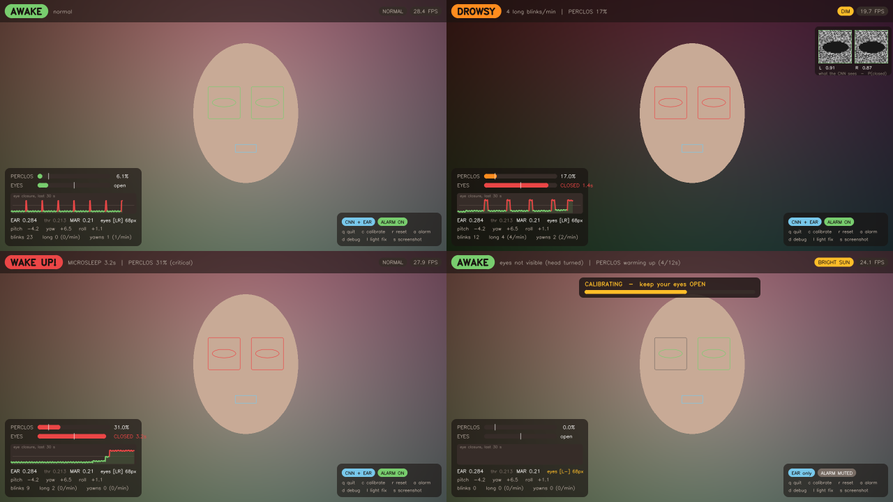
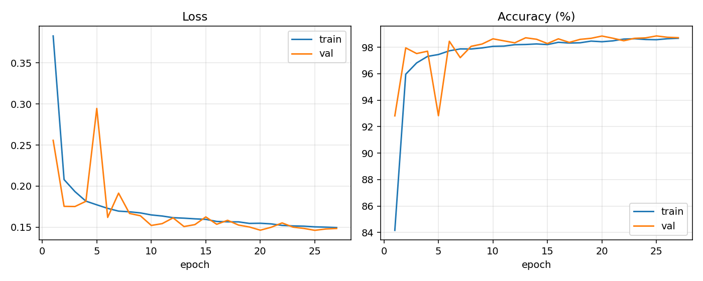
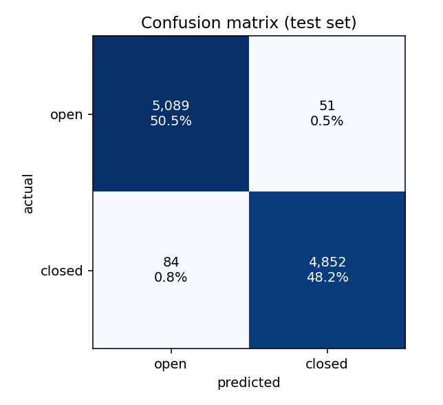
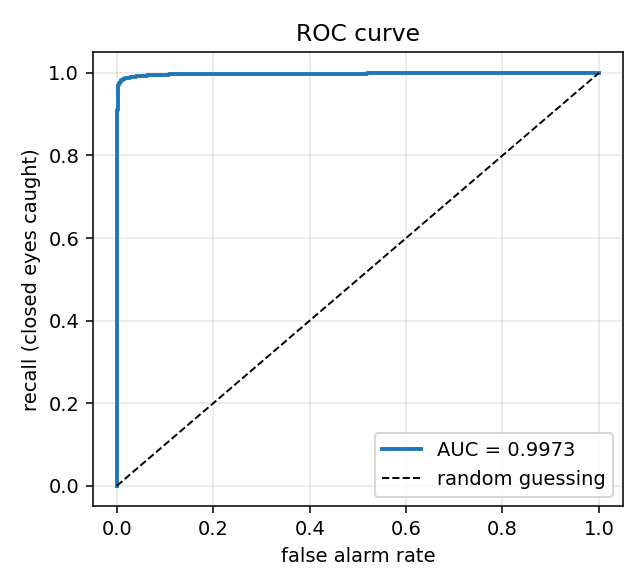

# Drowsy Driver Detection

Real-time driver-fatigue detection from a plain webcam. A CNN trained from
scratch decides whether each eye is open or closed; facial geometry measures
eye/mouth openness and head angle; a temporal layer fuses all of it over a
30-second window and raises a graded alarm.

Built end to end: dataset preparation, model training, honest evaluation, and a
live application.

```
webcam frame
     |
     +--> MediaPipe FaceMesh ---> 478 facial landmarks
     |            |
     |            +--> EAR   (Eye Aspect Ratio)   --+   geometry, no training
     |            +--> MAR   (Mouth Aspect Ratio) --+   -> yawns
     |            +--> head pose (pitch/yaw/roll) --+   -> nodding off
     |                                              |
     +--> crop both eyes --> TRAINED CNN -----------+   -> P(eye closed)
                                                    |
                          +-------------------------+
                          v
              TEMPORAL FUSION  (the actual decision)
              PERCLOS . microsleep . blink rate . yawn rate . head pose
                          v
              AWAKE -> EYES OFF ROAD -> DROWSY -> WAKE UP!
```

---

## Why it is built this way

**A closed eye is not drowsiness. A closed eye for 800 milliseconds is.**

You blink every few seconds and a blink lasts 100–400 ms. A detector that alarms
on any closed frame fires constantly, the driver switches it off, and the system
has made the road *less* safe than no system at all.

So the model never decides on a single frame. It tracks eye state over time and
computes **PERCLOS** — the percentage of the last 30 seconds the eyes were
closed — which is the actual automotive-industry fatigue standard.

**Why both a CNN and geometry?** They fail in different situations. EAR is
person-specific and calibratable but breaks with glasses, shadows, and off-angle
faces. The CNN is accurate but knows nothing about *your* eye shape. Fusing them
is more robust than either alone.

---

## Quick start

```bash
git clone https://github.com/Mohammad-Umar7/drowsy-driver-detection
cd drowsy-driver-detection
python -m venv .venv
.venv\Scripts\activate          # Windows   (source .venv/bin/activate on mac/linux)
pip install -r requirements.txt
```

> **Windows note:** MediaPipe requires `protobuf < 5`. If you see
> `Failed to parse: node { calculator: "ImagePropertiesCalculator" ... }`,
> run `pip install "protobuf>=4.25.3,<5"`.

### Run the live demo

```bash
python -m src.infer
```

Press **`c`** first and hold your eyes open for 3 seconds — this calibrates the
EAR threshold to *your* face and materially improves accuracy.

| Key | Action |
|-----|--------|
| `q` | quit |
| `c` | calibrate (hold eyes open 3 s) |
| `r` | reset counters |
| `a` | mute / unmute alarm |
| `d` | debug view — shows the exact 32×32 crops the CNN sees |
| `l` | toggle night/sun enhancement, to see what it's doing |
| `s` | screenshot to `reports/` |



The display is drawn with plain OpenCV, which has no UI toolkit: a translucent
panel is a blended copy of the pixels under it, and a rounded corner is a
circle (`src/hud.py`). The strip in the metrics card is the last 30 seconds of
the fused eye-closure score, red where the eyes were shut. A blink is a narrow
spike, a microsleep is a wide red block, and the slide into fatigue is spikes
getting wider and closer together, so "why did it just alarm?" is answerable at
a glance. (These frames are rendered without a camera to check the layout, so
the face is a placeholder.)

### The alarm

A beep does not wake a sleeping driver. Three things do, and the alarm does
all three (`src/alarm.py`, `Alarm.kt`):

- **A siren, not a tone.** A pitch sweeping 700 → 1500 Hz and back, with
  harmonics so it is harsh rather than pure. Hearing habituates to a steady
  note within seconds; it cannot habituate to one that keeps changing.
- **Escalation.** Every consecutive **WAKE UP!** inside 12 seconds is longer
  than the last: two sweeps, then three, then four.
- **A voice.** After the siren it *says* "Wake up!", and once it has escalated,
  "Wake up! Pull over safely." Speech tells a half-awake person what to do.
- **No waiting.** The DROWSY nudge and the microsleep it warns about are often
  a second apart. Going CRITICAL bypasses the alarm cooldown, and the siren cuts
  a nudge that is still playing short rather than queueing behind it.

Distraction stays a soft two-note chirp on purpose: it is a reminder, and an
aggressive tone for a mirror check trains the driver to ignore every alert.
The sounds are synthesised in numpy, so there are no audio files and nothing
to install; speech uses what the OS already has (Windows SAPI, macOS `say`,
`espeak` on Linux). On the phone the siren plays on the *alarm* stream, which
silent mode cannot mute, the volume is raised for the burst, and the phone
vibrates; long-press **Mute** to hear it before you need it.

### Run it off your phone in a car

Your phone beats a laptop webcam: better low-light sensor, and it mounts where
you need it. Install **IP Webcam** (Android), start the server, put the phone on
the same WiFi, then:

```bash
python -m src.infer --source http://192.168.1.7:8080/video --rotate 270 --no-mirror
```

`--rotate` because a phone in a car mount films sideways and MediaPipe needs an
upright face. `--no-mirror` because a phone pointed at you isn't a mirror.
Full setup and troubleshooting: [docs/04-phone-night-and-sun.md](docs/04-phone-night-and-sun.md).

### Run it on your phone — no PC, no WiFi

There's a full native Android app in [`android/`](android/). The same pipeline,
the same model, running entirely on the phone.

```bash
cd android
./gradlew assembleDebug
adb install -r app/build/outputs/apk/debug/app-arm64-v8a-debug.apk
```

The built APK requests exactly two permissions — `CAMERA` and `VIBRATE`. There
is **no `INTERNET` permission**, so the operating system itself refuses any
socket the app opens. "Runs entirely on device" is enforced by Android rather
than asserted here.

(The first build *did* have `INTERNET`. Nothing in this codebase asked for it —
MediaPipe pulls in Google's telemetry uploader transitively and the manifest
merger adds a library's permissions to yours. Inspecting the built APK is what
caught it; it's stripped with `tools:node="remove"` now.)

Setup, install options and troubleshooting:
[docs/05-android-app.md](docs/05-android-app.md).

### Reproduce the model from scratch

```bash
# 1. dataset (326 MB, ~85k labelled infrared eye images, no account needed)
curl -L -o data/raw/mrlEyes_2018_01.zip https://mrl.cs.vsb.cz/data/eyedataset/mrlEyes_2018_01.zip

# 2. unzip, preprocess, split BY SUBJECT
python scripts/prepare_data.py

# 3. train  (~7 min on an RTX 4070)
python -m src.train

# 4. evaluate on subjects the model has never seen
python -m src.evaluate

# 5. run the test suites - temporal logic, video source, lighting, display.
#    No webcam needed. (Or one at a time: python -m tests.test_drowsiness)
python -m pytest tests/

# 6. verify the Kotlin port: constants mechanically, logic with its own JVM suite
python scripts/check_port_parity.py
cd android && ./gradlew testDebugUnitTest
```

---

## Results

Trained on the **MRL Eye Dataset** (84,898 infrared eye images, 37 subjects).

Splits are **subject-wise**: the 6 test subjects appear in no other split, so
every test image is a face the model has genuinely never seen.

| Split | Subjects | Images |
|-------|----------|--------|
| train | 25 | 59,636 |
| val   | 6  | 15,186 |
| test  | 6  | 10,076 |

### Eye-state CNN — test set, 6 unseen subjects, 10,076 images

| Metric | Value |
|---|---|
| Accuracy | **98.66 %** |
| Balanced accuracy | **98.65 %** |
| ROC-AUC | **0.9973** |
| Average precision | 0.9979 |
| Parameters | 139,426 |
| Training time | 7.2 min (RTX 4070, mixed precision, early-stopped at epoch 27) |
| Inference | ~78,000 eye crops/sec on GPU |

Those accuracy figures are measured **at the operating threshold the system
actually ships** (0.342, chosen below) — not at the default 0.5, which scores
98.48 % / 98.46 %. Quoting accuracy at a cutoff the product doesn't use makes a
whole results table untrustworthy, so `src.evaluate` prints both side by side.

Training accuracy (98.68 %) came out *below* validation accuracy (98.85 %) —
augmentation makes the training images harder than the clean validation ones,
so there is no overfitting to correct for.

### Choosing the operating threshold

The model outputs a probability, not a decision. Picking the cutoff is a
separate engineering choice, and 0.5 is not automatically the right one:

| Threshold | Recall | Precision | False alarms | **Missed closures** |
|---|---|---|---|---|
| 0.500 (default) | 97.37 % | 99.52 % | 23 | **130** |
| **0.342 (chosen)** | **98.30 %** | 98.96 % | 51 | **84** |
| 0.374 (recall ≥ 98 %) | 98.01 % | 99.04 % | 47 | 98 |

Moving the cutoff from 0.5 to 0.342 recovers **46 missed closed eyes** for the
price of 28 extra false alarms. That is a good trade here: a missed closure is a
safety failure, while a false alarm is smoothed away by the 30-second PERCLOS
window before it can ever ring a bell.

### Accuracy by subgroup (the honesty check)

| Subgroup | Images | Accuracy |
|---|---|---|
| No glasses | 7,818 | 99.62 % |
| **Glasses** | 2,258 | **95.35 %** |
| Good light | 1,059 | 99.62 % |
| Poor light | 9,017 | 98.55 % |

An overall average hides this. The model is **4.3 points worse on people wearing
glasses** — reflections and frames genuinely obscure the eye. Reporting that is
more valuable than reporting only the headline number.

| Training curves | Confusion matrix | ROC |
|---|---|---|
|  |  |  |

The temporal state machine is covered by 70 simulated-time tests
(`tests/test_drowsiness.py`) that verify normal blinking does **not** alarm,
a sustained closure **does**, talking is not mistaken for yawning, and the
verdict is identical at 10, 30 and 60 FPS:

```
[2] realistic blinking (0.2 s every 4 s) -> must NOT alarm
      PASS  still AWAKE          -> PERCLOS 5.3%, 7 blinks counted
[3] eyes shut 2.4 s -> CRITICAL (threshold 2.0 s)
      PASS  microsleep flag set
[6] talking (0.3 s mouth movements) -> must NOT count as yawns
      PASS  zero yawns counted   -> the duration gate rejected all of them
[9] SAME 2.3 s closure at 10 / 30 / 60 FPS -> identical verdict
      PASS  [(10,'CRITICAL'), (30,'CRITICAL'), (60,'CRITICAL')]
[12] PERCLOS must not fire before 12 s of data exist
      PASS  PERCLOS 34% ignored: PERCLOS warming up (4/12s)

70 passed, 0 failed
```

Every duration in the tests is read from `config.py` rather than hard-coded, so
retuning a threshold cannot silently invalidate the test that guards it.

Three further suites need no camera either: the video source (a file ends
cleanly and plays at its own frame rate, rotation and mirroring, a dead stream
does not block, a raising backend recovers), the lighting stage (the five
regimes, the comfort band, the eased gamma), and the display (every state
rendered at three frame sizes into memory). The Kotlin port has its own
22-test JVM suite of the same drowsiness scenarios, because a parity check on
constants cannot see a branch that drifted.

### Robustness to lighting

`python scripts/test_lighting.py` takes one clean reference frame of your face
and simulates night, sun and backlighting on it, so the **only** variable is the
light. `P(closed)` is the model's confidence the eye is shut; the decision
threshold is 0.342, and the eyes are open in every frame, so **lower is
correct**.

| Condition | enhancement OFF | enhancement ON |
|---|---|---|
| clean | 0.018 ✓ | **0.010** ✓ |
| dusk | 0.040 ✓ | **0.016** ✓ |
| **night** | **0.447 ✗** | **0.118** ✓ |
| **deep night** | **0.654 ✗** | **0.296** ✓ |
| bright sun | 0.013 ✓ | **0.012** ✓ |
| harsh sun | 0.018 ✓ | **0.008** ✓ |
| backlit | 0.016 ✓ | **0.012** ✓ |

**Conditions handled correctly: 5/7 → 7/7**, at 2.54 ms/frame.

Night is where it earns its place: without correction, darkness pushes *open*
eyes past the decision threshold and the system reports you as asleep while
you are wide awake.

An earlier version of this made the three sunlit cases measurably **worse**
(0.010 → 0.024, 0.022 → 0.039, 0.016 → 0.031), because gamma forced *every*
frame to one target — so a perfectly exposed scene at mean 183 was darkened
with gamma 2.19, the clamp ceiling, for no benefit. Frames in a comfortable
band are now left alone, and correction is better than no correction in every
condition.

### Live run on a real face

```
session      : 11.9s, 223 frames (18.8 FPS)
face tracked : 223/223 frames (100%)
peak state   : WAKE UP!
max PERCLOS  : 31.0%  (warn at 15%)
blinks 5 | yawns 0 | alarms fired 3
```

That first run also exposed a genuine bug: PERCLOS is a *percentage*, so with
only 12 s of data observed a single long blink read as 31% and fired CRITICAL
almost immediately. `perclos_min_obs_sec` now suppresses PERCLOS triggering
until the window holds enough data. Microsleep is unaffected — it measures an
absolute duration, so it stays responsive from the first second.

---

## Why subject-wise splitting matters

The dataset has ~85,000 images from only 37 people — thousands of near-identical
frames per person.

Shuffle all 85,000 images randomly and subject `s0012` lands in both train and
test. The model no longer has to learn *what a closed eye looks like*; it can
learn *"this is s0012's eyelid, and s0012's eye is usually open"*, then recognise
them in the test set and score brilliantly.

You would report 99.5% and then watch it fail on your own face. That is **data
leakage**, and it is the most common way ML projects lie to their authors.

This project splits by **person**, never by image. The reported number is lower
and honest.

---

## Project structure

```
src/
  config.py        every tunable number, in one place
  geometry.py      EAR, MAR, head pose (pure maths, no ML)
  preprocess.py    pixels -> model input. Shared by training AND live inference
  face.py          MediaPipe FaceMesh wrapper -> landmarks + eye crops
  source.py        webcam / video file / PHONE stream, with frame dropping
  lighting.py      adaptive night + sun correction (gamma + CLAHE in LAB)
  model.py         the CNN (139,426 parameters) + a transfer-learning variant
  dataset.py       PyTorch Dataset + data augmentation
  train.py         training loop: AMP, cosine schedule, early stopping
  evaluate.py      confusion matrix, ROC, PR, threshold selection, subgroups
  drowsiness.py    PERCLOS / microsleep / yawn / nod state machine
  alarm.py         non-blocking audible alarm
  hud.py           the on-screen display: cards, bars, the closure sparkline
  infer.py         live webcam application
scripts/
  prepare_data.py  unzip, preprocess, subject-wise split
  diagnose_pose.py guided pose diagnostic - run this when it misbehaves
  test_lighting.py night/sun robustness benchmark
  export_onnx.py   PyTorch -> ONNX for the phone, with parity verification
  check_port_parity.py  guards the Kotlin port against silent drift
tests/
  test_drowsiness.py   70 simulated-time checks of the state machine, no webcam required
  test_source.py       files end cleanly, pacing, rotation, dead and flaky streams
  test_lighting.py     the five regimes, gamma maths, comfort band, smoothing
  test_hud.py          every display state at three sizes, rendered into memory
android/app/src/test/
  DrowsinessMonitorTest.kt   22 JVM tests of the Kotlin state machine
docs/
  01-foundations.md       images, pixels, landmarks, EAR — assumes zero background
  02-cnn-explained.md     what a CNN and a kernel are, worked with real numbers
  03-training-explained.md loss, gradients, backprop, overfitting, reading the logs
  04-phone-night-and-sun.md phone-as-webcam, night, sunlight, troubleshooting
  05-android-app.md       the native app: install, permissions, gaps
  convolution-bench.html   INTERACTIVE - open in a browser, step a kernel across an eye
```

`src/preprocess.py` is the most important small file: training and live inference
call the *same* function, which is what prevents train/serve skew.

---

## Tuning

All thresholds live in [`src/config.py`](src/config.py), marked `# TUNE`.

| Symptom | Fix |
|---------|-----|
| Alarms while you are awake | Press `c` to calibrate. Then lower `ear_calib_ratio` (0.75 → 0.70) |
| Fires too eagerly on a blink | Raise `microsleep_sec` (2.0 → 3.0) |
| Too slow to react when you doze | Lower `microsleep_sec` (2.0 → 1.0) |
| Misses your closed eyes | Raise `ear_calib_ratio`, or lower `perclos_warn` |
| Yawns not detected | Lower `mar_thresh` (0.60 → 0.50) |
| Talking counted as yawning | Raise `yawn_min_sec` (1.5 → 2.0) |
| Fires when you check mirrors | Raise `distract_min_sec` and `nod_min_sec` |
| Too many alarms in traffic | Raise `perclos_warn` and `alarm_cooldown_sec` |

Current duration gates — nothing triggers until it has lasted this long:

| Trigger | Must last | Result |
|---|---|---|
| Eyes closed | **2.0 s** | CRITICAL — instant, no window needed |
| Mouth open | **1.5 s** | counts as one yawn (3/min → DROWSY) |
| Head tipped down | **2.5 s** | DROWSY — nodding off |
| Head turned away | **2.5 s** | EYES OFF ROAD |
| PERCLOS above 15% | needs **12 s** of data first | DROWSY |

---

## Limitations (stated honestly)

- **Sunglasses defeat it.** No eye visible means no eye signal. A production
  system would use a near-infrared camera, which sees through most sunglasses.
- **Trained on infrared images.** MRL is IR; a normal RGB webcam has different
  texture statistics. Calibration and EAR fusion absorb much of this, but
  fine-tuning on your own captures would close the gap further.
- **Software cannot invent a signal that was never captured.** Enhancement
  recovers faint detail; it does not help a genuinely black frame. For real
  night driving the correct answer is an IR illuminator, which is what
  production driver-monitoring systems use.
- **Backlit detection is untuned.** The classifier labels a synthetic backlit
  frame as `BRIGHT SUN`. The correction applied is still adequate, but the rule
  needs real sky-through-windscreen footage to tune properly.
- **One face only.** `max_num_faces=1` — the driver.
- **Not a certified safety device.** This is a student/research project.

---

## Credits

- **MRL Eye Dataset** — Media Research Lab, VŠB – Technical University of
  Ostrava. <http://mrl.cs.vsb.cz/eyedataset>
- **MediaPipe FaceMesh** — Google.
- EAR formula — Soukupová & Čech, *Real-Time Eye Blink Detection using Facial
  Landmarks* (2016).
- PERCLOS — Wierwille et al.; adopted as a US Department of Transportation
  drowsiness measure.

## License

MIT
